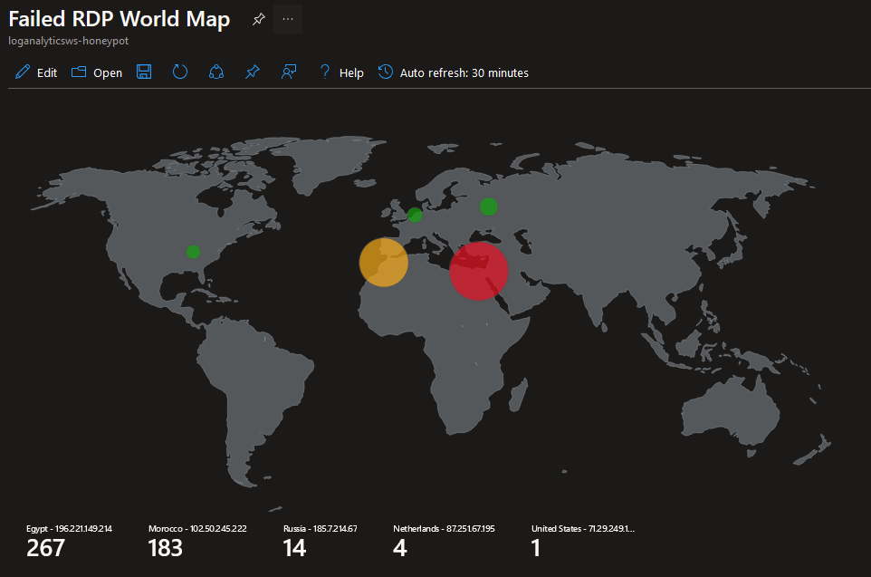

# Azure Sentinel Honeypot: A Write-Up

## Overview

This project documents the setup and analysis of a honeypot deployed in Azure to observe global attack patterns. Using Azure Sentinel, Microsoft’s cloud-native Security Information and Event Management (SIEM) tool, we monitored failed Remote Desktop Protocol (RDP) login attempts on a deliberately vulnerable Windows virtual machine (VM). Enriched logs were visualized on a world map to highlight the geographic origins of attacks.

The goal was to explore the ease with which exposed systems are discovered and targeted, while showcasing Azure Sentinel's capabilities in log ingestion, custom enrichment, and threat visualization.

## Key Components

### Honeypot Virtual Machine (VM)

A Windows VM was deployed in Azure, configured without firewalls to simulate a vulnerable endpoint. This setup allowed attackers to discover and target the system with brute-force RDP login attempts.

### Log Analytics Workspace (LAW)

A Log Analytics Workspace was established to collect security logs from the VM. This served as the central repository for raw event data and custom logs created during the enrichment process.

### Log Enrichment via PowerShell

A PowerShell script was utilized to:

1. Extract attacker IP addresses from failed RDP login events.

2. Query a geolocation API to retrieve geographic details (country, latitude, longitude).

3. Write enriched logs to a custom log file for further analysis.

### Azure Sentinel Integration

Sentinel was configured to connect with the Log Analytics Workspace, enabling advanced threat analysis and visualization. Custom logs were parsed, and enriched data was mapped to visualize global attack origins.

## Process Summary

1. **Setting Up the Honeypot VM**  
   A Windows virtual machine was deployed with its external firewall and Windows firewall disabled. This configuration ensured the system was highly discoverable by attackers, serving as an ideal honeypot for logging malicious activities.

2. **Configuring Log Analytics Workspace** 
   The VM’s security event logs were connected to a Log Analytics Workspace. This allowed the collection of failed RDP login attempts, which were essential for the subsequent enrichment process.

3. **Geolocation Data Enrichment** 
   A PowerShell script was run on the VM to process failed login events. The script extracted attacker IP addresses and queried a geolocation API to retrieve country, latitude and longitude, and state/province.The enriched data was saved as a custom log file and ingested into the Log Analytics Workspace.

4. **Visualization with Azure Sentinel** 
   Using Azure Sentinel, a custom workbook was created to display the enriched data on a world map. The map plotted attacker origins by latitude/longitude or country, highlighting the global scale of the threats.

## Observations

Attack Trends

Within 16 hours of deployment, the honeypot attracted hundreads of login attempts from multiple countries, including:

- Egypt
- Morroco
- Russia
- Netherlands

### Techniques and Patterns

Attackers frequently targeted common usernames like “administrator”, Test, and thec computers's hostname "honeypot". Most of the traffic appears to be brute force traffic.

## Lessons Learned

Exposed Hosts are Rapidly Targeted: The honeypot demonstrated how quickly vulnerable systems are discovered and attacked, underscoring the importance of strong security configurations.

Log Enrichment Enhances Insights: Geolocation data provided threat intelligence on what countries are likely to attack systems.

SIEM Capabilities in Action: Azure Sentinel’s integration with Log Analytics allowed for effective visualization and analysis of the data.

## Next Steps

- Explore Sentinel’s advanced features, such as alerting and automation.
- Test additional protocols beyond RDP to broaden the scope of analysis.
- Implement more efficient methods for log enrichment and ingestion.

## Inspiration

This lab draws inspiration from Josh Makador's [SIEM Tutorial](https://www.youtube.com/watch?v=RoZeVbbZ0o0).

While following his guidance, adjustments were made to account for changes in Azure's interface and updated log ingestion processes. Additionally, a query-based approach was utilized instead of relying on custom fields.

## Skills Used:

Azure, Microsoft Sentinel, Powerhsell, API, Automation, SIEM, Log Analysis, Data Enrichment, Therat Analysis
